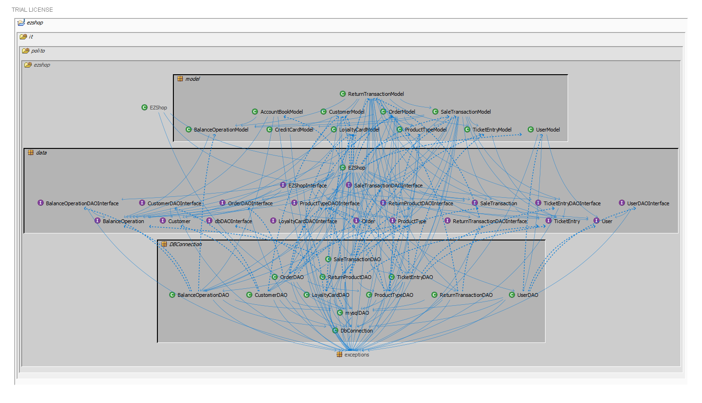
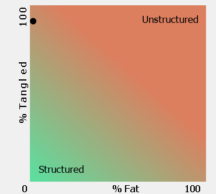
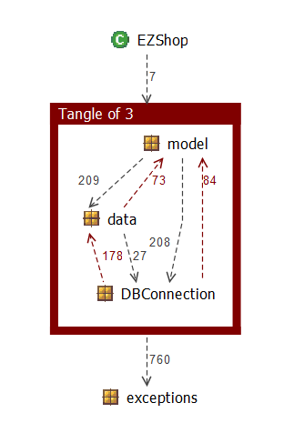

# Design assessment


```
<The goal of this document is to analyse the structure of your project, compare it with the design delivered
on April 30, discuss whether the design could be improved>
```

# Levelized structure map
```
<Applying Structure 101 to your project, version to be delivered on june 4, produce the Levelized structure map,
with all elements explosed, all dependencies, NO tangles; and report it here as a picture>
```



# Structural over complexity chart

```
<Applying Structure 101 to your project, version to be delivered on june 4, produce the structural over complexity chart; and report it here as a picture>
```



# Size metrics

```
<Report here the metrics about the size of your project, collected using Structure 101>
```


| Metric                                    | Measure |
| ----------------------------------------- | ------- |
| Packages                                  | 7        |
| Classes (outer)                           | 65        |
| Classes (all)                             | 68        |
| NI (number of bytecode instructions)      | 13K        |
| LOC (non comment non blank lines of code) | 6K        |


# Items with XS

```
<Report here information about code tangles and fat packages>
```

| Item | Tangled | Fat  | Size | XS   |
| ---- | ------- | ---- | ---- | ---- |
| ezshop.it.polito.ezshop     | 22        | 11     | 13330     | 2888     |
| ezshop.it.polito.ezshop.DBConnection.ProductTypeDAO.addProductType     |         | 21     | 406     | 116     |
| ezshop.it.polito.ezshop.DBConnection.ProductTypeDAO.updateProductType     |         | 21     | 336     | 96     |
| ezshop.it.polito.ezshop.model.SaleTransactionModel.receiveCreditCardPayment     |         | 25     | 146     | 58     |
| ezshop.it.polito.ezshop.DBConnection.TicketEntryDAO.addTicketEntry     |         | 19     | 250     | 52     |
| ezshop.it.polito.ezshop.DBConnection.ReturnProductDAO.addReturnProduct     |         | 18     | 222     | 37     |
| ezshop.it.polito.ezshop.model.SaleTransactionModel.deleteProductFromSale     |         | 20     | 139     | 34     |
| ezshop.it.polito.ezshop.model.ReturnTransactionModel.returnCreditCardPayment     |         | 19     | 131     | 27     |
| ezshop.it.polito.ezshop.model.UserModel.createUser     |         | 17     | 125     | 14     |
| ezshop.it.polito.ezshop.model.LoyaltyCardModel.attachCardToCustomer     |         | 16     | 95     | 5     |


# Package level tangles

```
<Report screen captures of the package-level tangles by opening the items in the "composition perspective" 
(double click on the tangle from the Views->Complexity page)>
```



# Summary analysis

```
<Discuss here main differences of the current structure of your project vs the design delivered on April 30>
<Discuss if the current structure shows weaknesses that should be fixed>
```

The design document delivered on April 30th has been followed quite accurately, which has been structured in such a way that
we have been able to divide the classes according to the MVC pattern: in fact the software shows 0% of fat.
<br>
However, the tangle parameter is high, being about 90%, but it could be reduced by adding another package where we could move
the methods contained in the model package classes (except for getters and setters), thus eliminating the cycles due to
the calling of the model classes constructors, getters and setters by the DAO classes, and the calling of the DAO classes methods
by the model classes.
<br>
Moreover, using this solution we could aim to lower the tangle percentage without increasing the fat percentage.