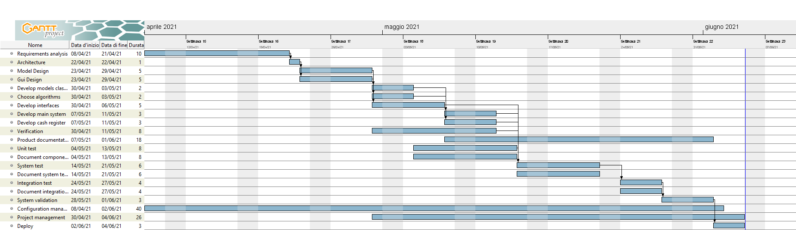

1
2
3
4
5
6
7
8
9
10
11
12
13
14
15
16
17
18
19
20
21
22
23
24
25
26
27
28
29
30
31
32
33
34
35
36
37
38
39
40
41
42
43
44
45
46
47
48
49
50
51

# Project Estimation  
Authors: Matteo Favretto, Vincenzo Sagristano, Alberto Castrignanò, Francesca Silvano
Date: 21/04/2021
Version: 1

# Contents
- [Estimate by product decomposition]
- [Estimate by activity decomposition ]
# Estimation approach
<Consider the EZGas  project as described in YOUR requirement document, assume that you are going to develop the project INDEPENDENT of the deadlines of the course>
# Estimate by product decomposition
### 
|             | Estimate                        |
| ----------- | ------------------------------- |
| NC =  Estimated number of classes to be developed   | 23 |
|  A = Estimated average size per class, in LOC       | 90 |
| S = Estimated size of project, in LOC (= NC * A) | 2070 |
| E = Estimated effort, in person hours (here use productivity 10 LOC per person hour)  | 207 |
| C = Estimated cost, in euro (here use 1 person hour cost = 30 euro) | 6210 |
| Estimated calendar time, in calendar weeks (Assume team of 4 people, 8 hours per day, 5 days per week ) | 1,4 |
# Estimate by activity decomposition
### 
|         Activity name    | Estimated effort (person hours)   |
| ----------- | ------------------------------- |
| Requirements analysis | 80 |
| Architecture | 12 |
| Model design | 80 |
| Gui design | 80 |
| Develop models classes | 16 |
| Choose algorithms | 16 |
| Develop interfaces | 40 |
| Develop main system | 40 |
| Develop cash register | 32 |
| Verification | 30 |
| Product documentation | 30 |
| Unit test | 22 |
| Document components tests | 20 |
| System test | 60 |
| Document system tests | 60 |
| Integration test           | 30 |
| Document integration tests | 30 |
| System validation          | 50 |
| Configuration management   | 30 |
| Project management | 200 |
| Deploy | 40 |
###

