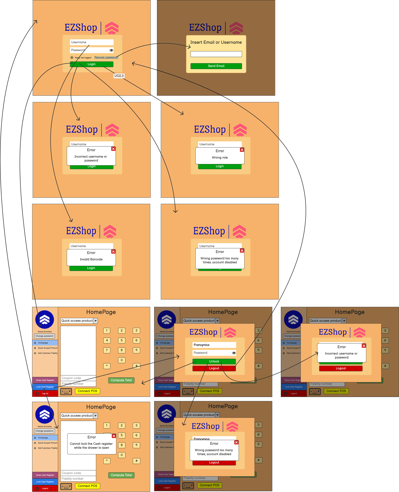
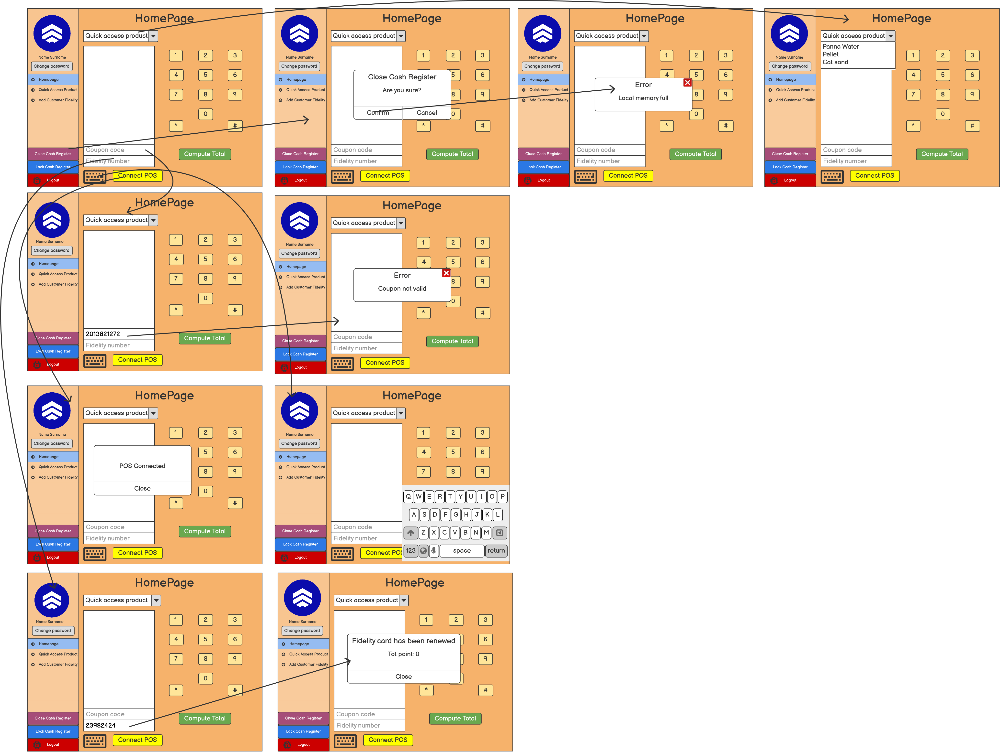

# Graphical User Interface Prototype  

Authors: Matteo Favretto, Vincenzo Sagristano, Alberto Castrignanò, Francesca Silvano

Date: 21/04/2021

Version: 0.9.3

\<Report here the GUI that you propose. You are free to organize it as you prefer. A suggested presentation matches the Use cases and scenarios defined in the Requirement document. The GUI can be shown as a sequence of graphical files (jpg, png)  >

<h3>First software use</h3>

<h3>Cash register Login<h3>

<h3>Cash register<h3>

<h3>Manager or Owner Login<h3>

<h3>Manager GUI</h3>

<h3>Inventory</h3>

<h3>Accounting Data</h3>

<h3>Settings</h3>

<h3>Employees</h3>

<h3>System Management</h3>

<h3>Suppliers</h3>
